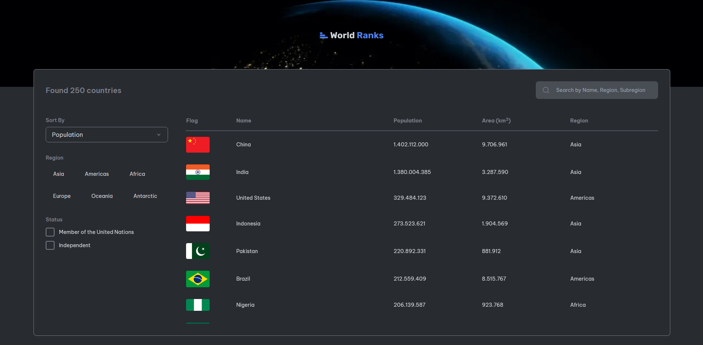

# Country Page



## Deskripsi

Aplikasi "Country Page" adalah platform yang menyediakan informasi lengkap tentang berbagai negara di seluruh dunia. Dengan aplikasi ini, pengguna dapat dengan mudah menemukan data terkait negara seperti nama, bendera, populasi, luas wilayah, region, mata uang, dan bahasa resmi. Fitur pencarian yang intuitif memungkinkan pengguna untuk mencari negara berdasarkan nama, region, atau subregion tertentu. Selain itu, pengguna juga dapat menyortir negara berdasarkan populasi, luas wilayah, atau abjad. Dengan tampilan yang bersih dan informatif, "Country Page" menjadi sumber informasi yang berguna bagi mereka yang ingin mempelajari lebih lanjut tentang negara-negara di dunia.

## Cara Install

1. Pastikan Anda telah menginstal Node.js dan npm di komputer Anda.
2. Clone repositori ini:

```bash
git clone https://github.com/nama-user/repo-aplikasi.git
```

3. Masuk ke direktori aplikasi

```bash
cd country-page
```

4. Masuk ke direktori aplikasi

```bash
npm install
```

5. Masuk ke direktori aplikasi

```bash
npm run dev
```

Aplikasi akan berjalan di http://localhost:3000.

## Lisensi

MIT
